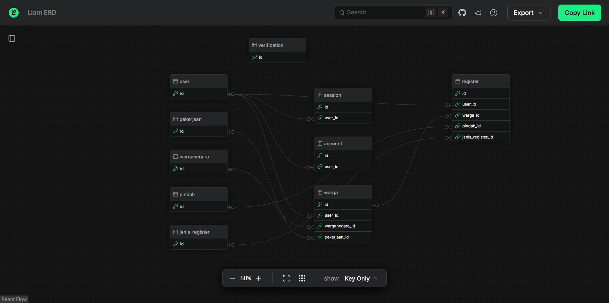

## Aplikasi Pendataan Desa Backend

<!--  -->

Aplikasi ini dibangun untuk mendukung sistem informasi pengelolaan data desa. Aplikasi ini menyediakan endpoint untuk manajemen data warga, registrasi peristiwa kependudukan, dan administrasi desa lainnya.

> [!NOTE]
> Backend API untuk aplikasi Pendataan Desa yang dibangun dengan Nest.js, dirancang untuk terintegrasi dengan Frontend. Repository ini cocok sebagai referensi pembelajaran untuk memahami cara membuat REST API Backend yang modern dengan struktur yang terorganisir.

## Fitur

- Sistem Autentikasi & Manajemen User: Sistem login dengan role-based access control
- Manajemen Data Penduduk: CRUD data warga dengan informasi lengkap
- Database Referensi
- Sistem Registrasi/Pencatatan Peristiwa
- Dashboard Analytics: Data statistik kependudukan

Selain fitur-fitur di atas, Anda juga bisa menambahkan fitur lainnya, jika mempunyai saran dan ide yang ada di benak Anda.

## Teknologi

Proyek ini dibangun menggunakan teknologi berikut:

| Kategori       | Nama                                                                    |
| -------------- | ----------------------------------------------------------------------- |
| Backend        | [**Nest.js**](https://nestjs.com/)                                      |
| Database       | [**PostgreSQL**](https://www.postgresql.org/)                           |
| ORM            | [**Drizzle**](https://orm.drizzle.team/)                                |
| Authentication | [**Better Auth**](https://www.better-auth.com/docs/integrations/nestjs) |

## Dokumentasi API

Dokumentasi API lengkap dapat diakses dengan mengunjungi endpoint berikut:

```
/api/docs
```

Untuk dokumentasi khusus endpoint autentikasi, Anda dapat mengunjungi:

```
/api/auth/reference
```

Dokumentasi ini menyediakan:

- Daftar lengkap endpoint yang tersedia
- Kemampuan untuk mencoba endpoint langsung dari browser
- Parameter request yang diperlukan
- Format response untuk setiap endpoint

### ER diagrams



Untuk melihat diagram ER interaktif menggunakan Liam ERD, ikuti langkah-langkah berikut:

1.  **Inisialisasi Liam ERD CLI:**
    Jika Anda belum melakukannya, inisialisasi CLI Liam ERD dengan perintah berikut:
    ```bash
    npx @liam-hq/cli init
    ```

2.  **Bangun Diagram ER dari Skema Drizzle Anda:**
    Gunakan perintah `erd build`. Pastikan untuk mengganti `src/common/database/schema.ts` dengan jalur yang benar ke file skema Drizzle Anda. Jika skema Anda terbagi dalam beberapa file, Anda dapat menggunakan pola glob.
    ```bash
    npx @liam-hq/cli erd build --format drizzle --input "src/common/database/schema.ts"
    ```
    Perintah ini akan menghasilkan file-file visualisasi ERD di direktori `dist`.

3.  **Sajikan Diagram ER Menggunakan Server HTTP Lokal:**
    Setelah diagram ER dihasilkan, Anda dapat melihatnya di browser Anda dengan menjalankan server HTTP lokal dari direktori `dist`:
    ```bash
    npx serve dist/
    ```
    Buka URL yang diberikan (biasanya `http://localhost:3000`) di browser Anda untuk melihat diagram ER interaktif.


## Kontribusi

Dengan senang hati, kami menyambut kontribusi dari siapa pun. Bantu kembangkan Aplikasi? silakan membaca [panduan kontribusi](https://github.com/IRTIDEATH/Pendataan-Desa-API/blob/main/CONTRIBUTING.md) untuk informasi lebih lanjut.

## Lisensi

Dengan berkontribusi, Anda setuju bahwa kontribusi Anda akan dilisensikan dengan lisensi yang sama dengan proyek ini (MIT).
Silakan membaca _file_ [LICENSE](https://github.com/IRTIDEATH/Pendataan-Desa-API/blob/main/LICENSE)

### Daftar Pustaka

- Pembuat - [IRTIDEATH](https://github.com/IRTIDEATH) dan para Kontributor keren.
- Setup README dan Contributing markdown ini mengikuti Repositori: [sensasi-apps/sensasi-pos](https://github.com/sensasi-apps/sensasi-pos)
